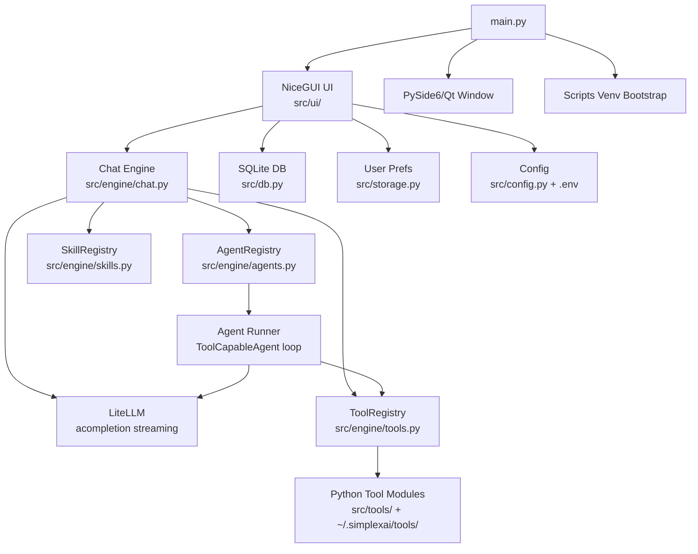
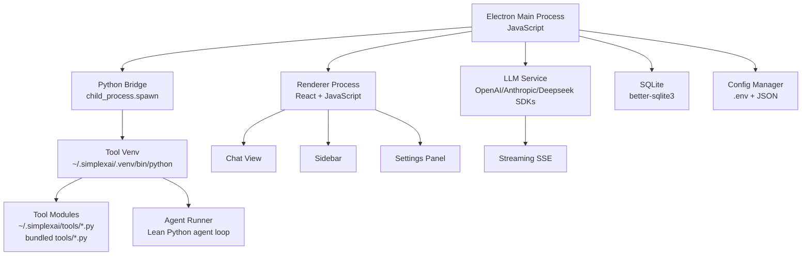

# Simplex AI — Migration Plan: Electron + JavaScript

## Goal

Migrate Simplex AI from a Python monolith (NiceGUI + PySide6 + LiteLLM) to:
- **Main App:** Electron + JavaScript (UI, LLM orchestration, chat engine, persistence)
- **Python Tools:** Kept as-is in `~/.simplexai/tools/`, executed as subprocesses inside a dedicated `uv`-managed venv

This eliminates all Python UI dependency conflicts (NiceGUI, PySide6, Qt, GTK, WebKitGTK) while preserving the powerful dynamic tool/agent plugin system.

---

## Current Architecture Summary



### What Gets Deleted (Python)
- `src/ui/` — All NiceGUI components (app.py, chat_view.py, sidebar.py, settings.py, state.py)
- `main.py` — Entry point with NiceGUI/PySide6 bootstrap
- `qt_window.py` — PySide6 wrapper
- Dependencies: `nicegui`, `pyside6`, `pydantic-settings` (from main app)

### What Gets Rewritten in JavaScript
- Chat engine (LLM streaming loop, multi-turn tool execution)
- Tool/Agent/Skill registry (discovery + schema extraction via Python bridge)
- Tool call parser (XML block extraction from LLM responses)
- SQLite persistence (chat sessions)
- Config management (.env loading)
- User preferences (JSON read/write)
- Context management (token counting, message trimming)
- System prompt builder
- Full UI (chat, sidebar, settings)

### What Stays in Python (Unchanged)
- All tool `.py` files in `src/tools/` and `~/.simplexai/tools/`
- All agent `.md` definition files in `src/agents/` and `~/.simplexai/agents/`
- All skill `.py` files in `src/skills/` and `~/.simplexai/skills/`
- Scripts in `~/.simplexai/scripts/`

---

## Target Architecture



---

## User Review Required

> [!IMPORTANT]
> **Breaking Change:** The migration creates a completely new project. The existing Python codebase will NOT be modified — the Electron app is built from scratch alongside it. Users will need to install Node.js 20+ and run `npm install` once.

> [!IMPORTANT]  
> **LLM Provider Strategy:** Without LiteLLM, you need to decide which LLM providers to support natively. LiteLLM abstracts 100+ providers behind a single API. In JavaScript, the options are:
> 1. **Use the OpenAI SDK only** — works with OpenAI, DeepSeek, and any OpenAI-compatible API (Ollama, vLLM, etc.) via `baseURL` override. This covers your current use case (`openai/deepseek-chat`).
> 2. **Use multiple SDKs** — Add `@anthropic-ai/sdk`, `@google/generative-ai` if you need Claude/Gemini natively.
> 3. **Keep a thin Python LiteLLM bridge** — If you want to keep the exact same multi-provider routing. This adds complexity.
>
> **Recommendation:** Option 1 (OpenAI SDK only) covers 90% of use cases. DeepSeek, Ollama, and most local models are OpenAI-compatible. Add more SDKs later if needed.

> [!WARNING]
> **XML Tool Calling:** Your current system uses a custom XML-based tool calling format (`<tool_name><param>value</param></tool_name>`) instead of OpenAI's native function calling. This was needed because some models don't support function calling. The migration must preserve this XML parser in JavaScript.

---

## Open Questions

> [!IMPORTANT]
> **1. Agent Execution — Where Does It Run?**
> Sub-agents (like `create_doc`) run a multi-turn LLM loop with tool calls. Two options:
> - **A) Rewrite agent_runner in JavaScript** — The Electron main process runs the agent loop directly. Tool calls are dispatched to Python via the bridge. This is simpler but means the agent orchestration logic lives in JavaScript.
> - **B) Keep agent_runner in Python** — The Electron app spawns a long-running Python process for each agent invocation. The Python process runs the LLM loop internally (using `litellm`) and streams results back to Electron via stdout JSON lines. This preserves the existing Python agent logic but adds complexity (two LLM calling paths).
>
> **Recommendation:** Option A. The agent loop is straightforward (call LLM → parse response → execute tools → repeat). Rewriting it in JavaScript is simpler than maintaining two parallel LLM calling stacks.

> [!IMPORTANT]
> **2. Project Location**
> Where should the new Electron project live?
> - **A)** Same repo, new folder: `/mnt/DATA/Work/AI/PROJECTS/Simplex/electron/`
> - **B)** Completely separate repo
> - **C)** Replace the current project root (archive Python code to a branch)

> [!IMPORTANT]
> **3. React vs Vue vs Svelte for the Frontend**
> The current NiceGUI app uses Vue/Quasar internally. Options:
> - **React** — Largest ecosystem, most hiring/help resources
> - **Vue** — Closest to what NiceGUI uses internally (familiarity)
> - **Svelte** — Smallest bundle, simplest syntax, excellent DX
>
> **Recommendation:** React — largest ecosystem, best Electron integration tooling, most community support for the components you'll need (markdown rendering, code highlighting, virtual scrolling).

---

## Proposed Changes

### Phase 1: Project Scaffold & Core Infrastructure

#### [NEW] Electron + React + JavaScript project

Initialize with Vite + electron-builder + React:

```
simplex-electron/
├── package.json
├── vite.config.js               # Single Vite config (main + preload + renderer)
├── electron-builder.yml         # electron-builder config
├── src/
│   ├── main/                    # Electron main process
│   │   ├── index.js             # App entry, window creation
│   │   ├── ipc-handlers.js      # IPC bridge between main ↔ renderer
│   │   ├── config.js            # .env loading, settings management
│   │   ├── database.js          # SQLite (better-sqlite3)
│   │   ├── storage.js           # User preferences (JSON)
│   │   └── llm/
│   │       ├── client.js        # OpenAI SDK wrapper, streaming
│   │       └── token-counter.js # tiktoken-based token counting
│   ├── engine/                  # Chat engine (main process)
│   │   ├── chat.js              # Main LLM streaming loop
│   │   ├── tool-registry.js     # Tool discovery + Python bridge
│   │   ├── agent-registry.js    # Agent .md discovery + execution
│   │   ├── skill-registry.js    # Skill discovery
│   │   ├── tool-parser.js       # XML tool call parser
│   │   ├── context.js           # Token counting, message trimming
│   │   └── python-bridge.js     # Subprocess manager for Python tools
│   ├── renderer/                # React frontend
│   │   ├── index.html
│   │   ├── main.jsx             # React root
│   │   ├── App.jsx              # Main layout
│   │   ├── styles/
│   │   │   └── index.css        # Global styles, design system
│   │   ├── components/
│   │   │   ├── ChatView.jsx     # Chat message list + input
│   │   │   ├── ChatBubble.jsx   # Individual message bubble
│   │   │   ├── Sidebar.jsx      # Session list
│   │   │   ├── Settings.jsx     # Settings dialog
│   │   │   ├── ToolCallCard.jsx # Expandable tool call display
│   │   │   ├── ReasoningBlock.jsx # Collapsible thinking section
│   │   │   ├── StatusBar.jsx    # Token count, cost, connection status
│   │   │   └── MarkdownRenderer.jsx # react-markdown + syntax highlighting
│   │   ├── hooks/
│   │   │   ├── useChat.js       # Chat state management
│   │   │   ├── useSessions.js   # Session CRUD
│   │   │   └── useSettings.js   # Settings state
│   │   └── lib/
│   │       ├── ipc.js           # Type-safe IPC client
│   │       └── types.js         # Shared types (JSDoc)
│   └── preload/
│       └── index.js             # Secure IPC bridge (contextBridge)
└── tools/                       # Bundled Python tools (copied to ~/.simplexai/tools/)
    ├── bash.py
    ├── run_python.py
    ├── read_file.py
    ├── write_file.py
    ├── list_files.py
    ├── open_file.py
    ├── read_document.py
    ├── generate_pdf.py
    ├── use_vision.py
    ├── task_done.py
    └── get_current_time.py
```

---

### Phase 2: Python Tool Bridge

The critical piece — how JavaScript communicates with Python tools.

#### [NEW] `src/engine/python-bridge.js`

```
Electron Main Process                    Python Subprocess
─────────────────────                    ──────────────────
                                         ~/.simplexai/.venv/bin/python
                                         
1. bridge.inspectTool("bash.py")  ──→    bridge.py inspect bash.py
   ← JSON schema                 ←──    stdout: {"name":"bash", "description":..., "parameters":...}

2. bridge.executeTool(             ──→    bridge.py execute bash.py '{"command":"ls","explanation":"list"}'
     "bash", {command, explanation})
   ← result string                ←──    stdout: {"result": "file1.txt\nfile2.txt", "exit_code": 0}
```

#### [NEW] `bridge.py` — Minimal Python CLI

A single Python file placed at `~/.simplexai/bridge.py` that handles:
1. **`inspect <tool_path>`** — Imports the tool module, calls `get_description()`, prints JSON schema to stdout.
2. **`execute <tool_path> <args_json>`** — Imports the tool module, calls `execute(**args)`, prints result to stdout.
3. **`inspect-agent <agent_md_path>`** — Parses the .md agent definition, prints JSON config to stdout.

This bridge runs inside `~/.simplexai/.venv/bin/python`, so all tool dependencies are available.

Key design decisions:
- **One subprocess per tool call** (short-lived, stateless). No long-running Python daemon.
- **`_agent_params` injection:** The bridge receives `agent_params` as part of the args JSON and injects it into the tool's `execute()` if the tool accepts it.
- **Async tools:** The bridge wraps async `execute()` with `asyncio.run()`.
- **Confirmation flow:** For tools that trigger `on_confirmation_required` (like bash with dangerous commands), the bridge detects the danger patterns itself and returns a special `{"needs_confirmation": true, "reason": "..."}` response. Electron handles the UI confirmation, then re-calls with `{"confirmed": true}`.

---

### Phase 3: LLM Integration

#### [NEW] `src/main/llm/client.js`

Replaces LiteLLM with the OpenAI SDK:

```javascript
// Core streaming function — replaces Python's litellm.acompletion(stream=True)
async function* streamChat(messages, config) {
    const client = new OpenAI({
        apiKey: config.apiKey,
        baseURL: config.apiBase,  // DeepSeek, Ollama, etc.
    });
    
    const stream = await client.chat.completions.create({
        model: config.model,      // e.g., "deepseek-chat"
        messages,
        temperature: config.temperature,
        max_tokens: config.maxTokens,
        stream: true,
    });
    
    for await (const chunk of stream) {
        const delta = chunk.choices[0]?.delta;
        if (delta?.content) yield { type: "content", content: delta.content };
        // Handle reasoning_content for DeepSeek R1, etc.
        if (delta?.reasoning_content) {
            yield { type: "reasoning", content: delta.reasoning_content };
        }
    }
}
```

**Model name mapping:**
- Current format: `openai/deepseek-chat` (LiteLLM prefix)
- New format: Strip the `openai/` prefix → `deepseek-chat`, set `baseURL` to `https://api.deepseek.com`
- The config will store `model`, `apiKey`, and `apiBase` separately (no more LiteLLM routing)

---

### Phase 4: Chat Engine (JavaScript)

#### [NEW] `src/engine/chat.js`

Direct port of [chat.py](file:///mnt/DATA/Work/AI/PROJECTS/Simplex/src/engine/chat.py). The structure maps 1:1:

| Python (current) | JavaScript (new) |
|---|---|
| `stream_chat()` async generator | `streamChat()` async generator |
| `sanitize_messages()` | `sanitizeMessages()` |
| `litellm.acompletion(stream=True)` | `openai.chat.completions.create({stream: true})` |
| `StreamingToolParser` | `StreamingToolParser` class (ported) |
| `tool_registry.call(name, args)` | `pythonBridge.executeTool(name, args)` |
| `agent_registry.call(name, args)` | `agentRunner.runAgent(name, args)` |
| `skill_registry.call(name, args)` | `skillRegistry.call(name, args)` |
| Yields `{type: "content"}`, `{type: "reasoning"}`, `{type: "tool"}` | Same event types via IPC to renderer |

#### [NEW] `src/engine/tool-parser.js`

Port of [tool_parser.py](file:///mnt/DATA/Work/AI/PROJECTS/Simplex/src/engine/tool_parser.py):
- `StreamingToolParser` — accumulates streamed content, detects `<tool_name>...</tool_name>` XML blocks
- `extractToolBlocks()` — post-stream extraction
- `stripToolBlocks()` — removes XML from display content
- `formatResult()` — formats tool results for message history
- `formatDisplayForActivityLog()` — formats for UI display

---

### Phase 5: Agent Runner (JavaScript)

#### [NEW] `src/engine/agent-runner.js`

Port of [agent_runner.py](file:///mnt/DATA/Work/AI/PROJECTS/Simplex/src/engine/agent_runner.py) (`ToolCapableAgent`):

```javascript
class ToolCapableAgent {
    constructor(name, rolePrompt, allowedTools, maxRounds = 20, doneToolName = "task_done") {
        // ...
    }
    
    async run(taskInput, callbacks) {
        // 1. Build system prompt (role + XML tool schemas)
        // 2. Loop: call LLM → stream → parse XML tools → execute via bridge → repeat
        // 3. Check for _AGENT_DONE_ auto-termination
        // 4. Max rounds fallback
    }
}
```

Key differences from Python version:
- Tool execution goes through `pythonBridge.executeTool()` instead of `registry.call()`
- `_agent_params` (work_dir) is passed as part of the tool args JSON to the bridge
- Streaming callbacks are emitted via IPC to the renderer

---

### Phase 6: Database & Config

#### [NEW] `src/main/database.js`

Port of [db.py](file:///mnt/DATA/Work/AI/PROJECTS/Simplex/src/db.py) using `better-sqlite3`:

```javascript
// Same schema, same operations
class ChatDB {
    constructor(dbPath)  // ~/.simplexai/chats.db
    createSession(title, messages)
    updateSession(id, title, messages)
    getSession(id)
    listSessions(includeArchived)
    deleteSession(id)
    archiveSession(id)
    searchSessions(query)
}
```

#### [NEW] `src/main/config.js`

Replaces [config.py](file:///mnt/DATA/Work/AI/PROJECTS/Simplex/src/config.py):

```javascript
// Uses dotenv to load .env file
// Config shape:
//   model: string       — e.g., "deepseek-chat"
//   apiKey: string
//   apiBase: string     — e.g., "https://api.deepseek.com"
//   temperature: number
//   maxTokens: number
//   systemPrompt: string
//   logLevel: string
//   qtPort: number      — No longer needed (remove)
//   nativeMode: boolean — No longer needed (remove)
```

#### [NEW] `src/main/storage.js`

Port of [storage.py](file:///mnt/DATA/Work/AI/PROJECTS/Simplex/src/storage.py):

```javascript
// User preferences shape:
//   workingDirectories: string[]
//   showReasoning: boolean
// Read/write to ~/.simplexai/user_settings.json
```

---

### Phase 7: UI (React)

#### Design Approach
- **Dark mode by default** (matching current app)
- **Chat bubble layout** — user right-aligned, assistant left-aligned
- **Markdown rendering** — `react-markdown` + `rehype-highlight` for code blocks
- **Streaming display** — state updates on each chunk (React state + refs for performance)
- **Tool call cards** — expandable sections showing tool name, args, and result
- **Reasoning blocks** — collapsible "Thinking" sections

#### Key Components

| Component | Replaces | Description |
|---|---|---|
| `App.jsx` | `app.py` | Main layout: sidebar + chat area |
| `ChatView.jsx` | `chat_view.py` | Message list, input field, streaming display |
| `ChatBubble.jsx` | (inline in chat_view) | Individual message with markdown rendering |
| `Sidebar.jsx` | `sidebar.py` | Session list, new/rename/delete/archive |
| `Settings.jsx` | `settings.py` | Working dirs, model, temperature, toggles |
| `ToolCallCard.jsx` | (inline expansion) | Expandable tool call with result |
| `ReasoningBlock.jsx` | (inline expansion) | Collapsible reasoning/thinking |
| `StatusBar.jsx` | `state.py` (usage_label) | Token count, cost, connection status |
| `MarkdownRenderer.jsx` | `ui.markdown()` | react-markdown with syntax highlighting |

#### IPC Communication (Renderer ↔ Main Process)

```javascript
// Renderer → Main (invoke)
const sessions = await ipc.invoke('sessions:list')
const session = await ipc.invoke('sessions:load', sessionId)
await ipc.invoke('sessions:save', { id, title, messages })
await ipc.invoke('settings:save', preferences)

// Main → Renderer (streaming events via IPC)
ipc.on('chat:chunk', (event) => { /* append to current message */ })
ipc.on('chat:reasoning', (event) => { /* append to thinking block */ })
ipc.on('chat:tool', (event) => { /* show tool call card */ })
ipc.on('chat:status', (event) => { /* update status bar */ })
ipc.on('chat:usage', (event) => { /* update token/cost display */ })
ipc.on('chat:done', () => { /* finalize message */ })

// Renderer → Main (start chat)
ipc.send('chat:send', { messages, sessionId })

// Renderer → Main (cancel)
ipc.send('chat:cancel')
```

---

### Phase 8: First-Run Setup & Packaging

#### [NEW] First-run initialization

On first launch, the Electron app:

1. **Creates `~/.simplexai/`** directory structure:
   ```
   ~/.simplexai/
   ├── .venv/            # Tool execution venv
   ├── tools/            # Custom user tools
   ├── agents/           # Custom user agents
   ├── skills/           # Custom user skills
   ├── scripts/          # Reusable Python scripts
   ├── experience/       # Agent learning files
   ├── .tmp/             # Temporary files
   ├── chats.db          # SQLite database
   ├── user_settings.json
   └── bridge.py         # Python CLI bridge
   ```

2. **Copies bundled tools** from the app's `tools/` directory to `~/.simplexai/tools/` (only if not already present — user customizations are never overwritten).

3. **Creates the Python venv** (if `uv` is available):
   ```bash
   uv venv --python 3.11 ~/.simplexai/.venv
   uv pip install weasyprint pandas openpyxl pymupdf python-docx --python ~/.simplexai/.venv/bin/python
   ```
   Fallback if `uv` is not available:
   ```bash
   python3.11 -m venv ~/.simplexai/.venv
   ~/.simplexai/.venv/bin/pip install weasyprint pandas openpyxl pymupdf python-docx
   ```

4. **Copies `bridge.py`** to `~/.simplexai/bridge.py`.

5. **Copies bundled `README.md`** files to tools/agents/skills directories.

#### Packaging

Using electron-builder:
- **Linux:** AppImage + deb
- **Windows:** NSIS installer (exe)
- **macOS:** dmg + zip

The packaged app does NOT bundle Python. The user must have Python 3.11+ installed (or `uv` which auto-downloads it).

---

## Migration Mapping Reference

### Python → JavaScript: Module-by-Module

| Python Module | JavaScript Module | Notes |
|---|---|---|
| [main.py](file:///mnt/DATA/Work/AI/PROJECTS/Simplex/main.py) | `src/main/index.js` | Electron app entry |
| [qt_window.py](file:///mnt/DATA/Work/AI/PROJECTS/Simplex/qt_window.py) | (deleted) | Electron handles windowing |
| [src/config.py](file:///mnt/DATA/Work/AI/PROJECTS/Simplex/src/config.py) | `src/main/config.js` | dotenv instead of pydantic-settings |
| [src/db.py](file:///mnt/DATA/Work/AI/PROJECTS/Simplex/src/db.py) | `src/main/database.js` | better-sqlite3 |
| [src/storage.py](file:///mnt/DATA/Work/AI/PROJECTS/Simplex/src/storage.py) | `src/main/storage.js` | Plain JSON read/write |
| [src/prompts.py](file:///mnt/DATA/Work/AI/PROJECTS/Simplex/src/prompts.py) | `src/main/prompts.js` | TOML parsing via `@iarna/toml` |
| [src/engine/chat.py](file:///mnt/DATA/Work/AI/PROJECTS/Simplex/src/engine/chat.py) | `src/engine/chat.js` | Core streaming loop |
| [src/engine/tools.py](file:///mnt/DATA/Work/AI/PROJECTS/Simplex/src/engine/tools.py) | `src/engine/tool-registry.js` | Discovery via Python bridge |
| [src/engine/agents.py](file:///mnt/DATA/Work/AI/PROJECTS/Simplex/src/engine/agents.py) | `src/engine/agent-registry.js` | .md parsing in JS |
| [src/engine/agent_runner.py](file:///mnt/DATA/Work/AI/PROJECTS/Simplex/src/engine/agent_runner.py) | `src/engine/agent-runner.js` | ToolCapableAgent in JS |
| [src/engine/tool_parser.py](file:///mnt/DATA/Work/AI/PROJECTS/Simplex/src/engine/tool_parser.py) | `src/engine/tool-parser.js` | XML parser port |
| [src/engine/context.py](file:///mnt/DATA/Work/AI/PROJECTS/Simplex/src/engine/context.py) | `src/engine/context.js` | tiktoken for counting |
| [src/engine/skills.py](file:///mnt/DATA/Work/AI/PROJECTS/Simplex/src/engine/skills.py) | `src/engine/skill-registry.js` | Discovery via Python bridge |
| [src/engine/learning.py](file:///mnt/DATA/Work/AI/PROJECTS/Simplex/src/engine/learning.py) | `src/engine/learning.js` | Experience file management |
| [src/ui/app.py](file:///mnt/DATA/Work/AI/PROJECTS/Simplex/src/ui/app.py) | `src/renderer/App.jsx` | React layout |
| [src/ui/chat_view.py](file:///mnt/DATA/Work/AI/PROJECTS/Simplex/src/ui/chat_view.py) | `src/renderer/components/ChatView.jsx` | React chat component |
| [src/ui/sidebar.py](file:///mnt/DATA/Work/AI/PROJECTS/Simplex/src/ui/sidebar.py) | `src/renderer/components/Sidebar.jsx` | React sidebar |
| [src/ui/settings.py](file:///mnt/DATA/Work/AI/PROJECTS/Simplex/src/ui/settings.py) | `src/renderer/components/Settings.jsx` | React settings dialog |
| [src/ui/state.py](file:///mnt/DATA/Work/AI/PROJECTS/Simplex/src/ui/state.py) | `src/renderer/hooks/useChat.js` + `src/main/system-prompt.js` | Split: UI state in React, prompt building in main |
| [src/tools/*.py](file:///mnt/DATA/Work/AI/PROJECTS/Simplex/src/tools) | `tools/*.py` (bundled, copied at runtime) | Unchanged Python files |
| [src/agents/*.md](file:///mnt/DATA/Work/AI/PROJECTS/Simplex/src/agents) | `agents/*.md` (bundled, copied at runtime) | Unchanged .md files |

### NPM Dependencies

```json
{
  "dependencies": {
    "openai": "^4.x",           // LLM SDK (replaces litellm)
    "better-sqlite3": "^11.x",  // SQLite (replaces Python sqlite3)
    "dotenv": "^16.x",          // .env loading (replaces pydantic-settings)
    "tiktoken": "^1.x",         // Token counting (replaces litellm.token_counter)
    "@iarna/toml": "^3.x",      // TOML parsing for cli_prompts.toml
    "react": "^19.x",
    "react-dom": "^19.x",
    "react-markdown": "^9.x",   // Markdown rendering
    "rehype-highlight": "^7.x", // Code syntax highlighting
    "remark-gfm": "^4.x",      // GitHub Flavored Markdown
    "lucide-react": "^0.x"      // Icons
  },
  "devDependencies": {
    "vite": "^6.x",
    "vite-plugin-electron": "^0.x",
    "vite-plugin-electron-renderer": "^0.x",
    "electron": "^33.x",
    "electron-builder": "^25.x"
  }
}
```

---

## Verification Plan

### Automated Tests
1. **Unit tests (Vitest):**
   - XML tool parser: happy path, malformed XML, nested tags, streaming chunks
   - Config loader: .env parsing, defaults, missing values
   - Database: CRUD operations, search, archiving
   - Message sanitization: role filtering, empty content handling
   - System prompt builder: tool injection, agent descriptions, context

2. **Integration tests:**
   - Python bridge: inspect tool → get valid schema
   - Python bridge: execute tool → get result
   - Full chat loop with mock LLM: send message → stream response → tool call → tool result → final response

3. **E2E tests (Playwright + Electron):**
   - Launch app → see empty chat
   - Send message → see streaming response
   - Tool call display → expandable card
   - Sidebar: create/rename/delete sessions
   - Settings: add/remove working directories

### Manual Verification
- Compare chat output quality between Python and Electron versions using the same model/prompt
- Verify tool execution (bash, read_file, write_file) produces identical results
- Verify agent execution (create_doc) produces working PDFs
- Test first-run setup on a clean system (no ~/.simplexai/)
- Test with DeepSeek, Ollama, and at least one other provider

---

## Estimated Effort

| Phase | Description | Estimated Time |
|---|---|---|
| 1 | Project scaffold, Electron + React + JS setup | 1 day |
| 2 | Python bridge (bridge.py + python-bridge.js) | 1–2 days |
| 3 | LLM client (OpenAI SDK streaming) | 1 day |
| 4 | Chat engine (streaming loop + XML parser) | 2–3 days |
| 5 | Agent runner (ToolCapableAgent port) | 1–2 days |
| 6 | Database + Config + Storage | 1 day |
| 7 | Full UI (React components, styling, animations) | 3–5 days |
| 8 | First-run setup, packaging, testing | 2–3 days |
| **Total** | | **~12–18 days** |
